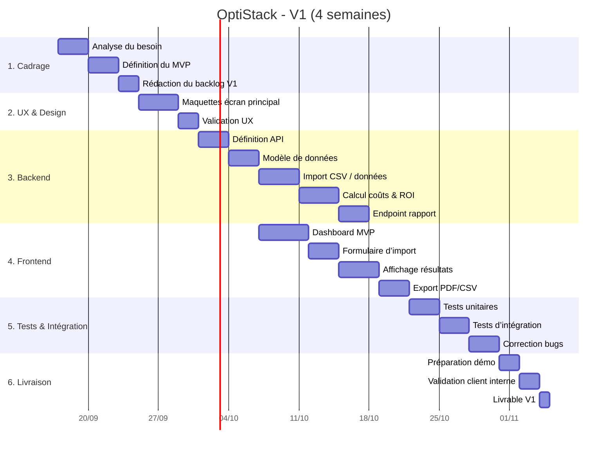

# Gantt - V1 OptiStack

## Objectif
Le Gantt ci-dessous décrit la mise en place de la V1 du projet OptiStack, centrée sur un MVP SaaS B2B pour l’analyse et la recommandation d’alternatives logicielles.

## Planning proposé (4 semaines)

## Délivrables attendus à la fin de la V1
- Dashboard fonctionnel avec coût actuel et recommandations
- Formulaire/import d’inventaire logiciel
- Calcul de ROI sur les alternatives proposées
- Rapport exportable
- Démo fonctionnelle de la solution

## Risques à surveiller
- Sous-estimation du temps de calcul de benchmark
- Qualité des données de parc logiciel insuffisante
- Réticence utilisateur sur le niveau de précision des recommandations

## Hypothèses de travail
- Les données de coûts et d’usage sont saisies ou importées dans un format standardisé
- Le MVP ne cible qu’une PME avec un parc logiciel modéré
- L’intelligence artificielle est utilisée comme aide à la recommandation, pas comme automatisation de migration
